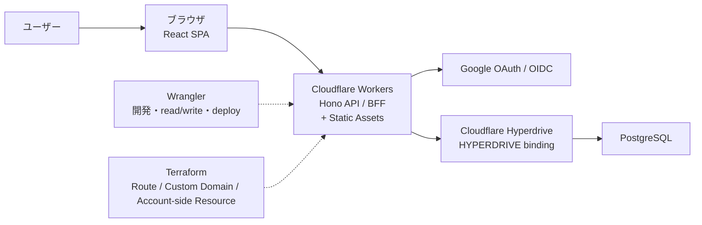

# Daily Leveling

[](https://github.com/hamakyo/daily-leveling/actions/workflows/ci.yml)

Daily Leveling は、Cloudflare Workers + React で構成する習慣トラッカー MVP です。
現在は Today / Weekly / Monthly の集計、`every_n_days` 習慣、簡易レベル表示、達成時の軽いフィードバックまで含みます。

## 技術スタック

- React SPA
- Hono on Cloudflare Workers
- PostgreSQL + Cloudflare Hyperdrive
- pnpm

## 構成図



## セットアップ

1. 依存関係をインストールします。

```bash
pnpm install
```

2. ローカル用の Worker 環境変数ファイルを作成します。

```bash
cp .dev.vars.example .dev.vars
```

3. 以下の値を `.dev.vars` に設定します。

- `DATABASE_URL`
- `APP_BASE_URL`
- `GOOGLE_CLIENT_ID`
- `GOOGLE_CLIENT_SECRET`

4. 環境変数を確認します。

```bash
pnpm run env:check
```

5. migration を PostgreSQL に適用します。

```bash
pnpm run db:migrate
```

環境別に切りたい場合の example:

```bash
cp .dev.vars.staging.example .dev.vars.staging
cp .env.staging.example .env.staging
```

## 開発

推奨するフルスタック開発コマンドは以下です。

```bash
pnpm dev
```

このコマンドで次の 2 つが同時に動きます。
- `vite build --watch`
  `dist/` を継続更新します。
- `wrangler dev`
  API とビルド済み SPA を同一オリジンで配信します。

個別に動かしたい場合は以下を使います。

```bash
pnpm dev:test
pnpm dev:staging
pnpm dev:production
pnpm dev:web
pnpm dev:worker
pnpm dev:worker:test
pnpm dev:worker:staging
pnpm dev:worker:production
pnpm run check
pnpm test
pnpm run test:e2e
pnpm run test:e2e:headed
pnpm run test:e2e:ui
pnpm run build
pnpm run env:check
pnpm run env:check:test
pnpm run env:check:staging
pnpm run env:check:production
pnpm run db:migrate:plan
pnpm run db:migrate:plan:test
pnpm run db:migrate:plan:staging
pnpm run db:migrate:plan:production
pnpm run db:migrate
pnpm run db:migrate:test
pnpm run db:migrate:staging
pnpm run db:migrate:production
pnpm run infra:fmt
pnpm run infra:validate
pnpm run deploy:dry-run:test
pnpm run deploy:dry-run:staging
pnpm run deploy:dry-run:production
pnpm run verify
pnpm run verify:full:test
pnpm run verify:full:staging
pnpm run verify:full:production
pnpm run release:check:test
pnpm run release:check:staging
pnpm run release:check:production
```

## 実行時メモ

- ローカル認証フローは `wrangler dev` による same-origin 前提です。
- `APP_BASE_URL` はローカル Worker の URL と一致させてください。
- Worker 実行時の DB 接続は `HYPERDRIVE.connectionString` を優先し、未設定時だけ `DATABASE_URL` に fallback します。
- `DATABASE_URL` は local dev、migration、Hyperdrive 作成元として残します。
- セッション Cookie は Worker 側で管理し、`HttpOnly` です。
- state-changing request は `Origin / Referer` を Worker 側で検証します。
- API と静的 HTML の両方に `Content-Security-Policy` などのセキュリティヘッダを付与します。
- Google ID token は `tokeninfo` ではなく JWKS を使って Worker 内で署名検証します。
- auth route のレート制限は `AUTH_RATE_LIMITS` KV binding を使い、local では binding 未設定時に no-op で動作します。
- UI のフォントスタックは sans-serif のみを使用します。

## E2E テスト

Playwright CLI による E2E テストを `tests/e2e` に置いています。

初回だけ Chromium をインストールします。

```bash
pnpm exec playwright install chromium
```

ローカル PostgreSQL に migration を適用したうえで、以下を実行します。

```bash
pnpm run test:e2e
```

`pnpm run test:e2e` は Playwright の `webServer` 経由で `pnpm dev:e2e` を起動します。
E2E 用 Worker は `http://127.0.0.1:8788` で動き、`.dev.vars` と `config/e2e.vars` を読み込みます。
`config/e2e.vars` では `E2E_TEST_MODE=true` を設定し、`/__e2e/*` のテスト補助 API を有効化します。
この補助 API は `E2E_TEST_MODE=true` 以外では `404` を返し、通常の dev/staging/production では使いません。

確認範囲:
- ログイン画面の表示
- Google OAuth start URL の生成
- オンボーディングテンプレート適用
- 習慣作成
- Today view のログ更新
- Weekly view の集計表示
- Monthly view の集計表示
- レベル表示と達成時フィードバック

## 詳細ドキュメント

- [アーキテクチャ](docs/architecture.md)
- [セキュリティ設計](docs/security.md)
- [デプロイ手順](docs/deployment.md)
- [テスト方針](docs/testing.md)
- [デザイン方針](DESIGN.md)

## Cloudflare の IaC

このプロジェクトは Cloudflare 環境を IaC 化できます。

推奨する責務分担は以下です。
- Wrangler
  ローカル開発、Worker の read/write、ビルド、コードのデプロイ
- Terraform
  Cloudflare 側の Worker サービス定義、Custom Domain、Route などの管理

Cloudflare 操作の標準経路:
- Worker の read/write は `wrangler` を使う
- account-side resource は Terraform を使う
- Cloudflare ダッシュボードや Codex プラグインは補助的な確認用途に留める
- Hyperdrive は環境ごとに `HYPERDRIVE` binding 名で固定する

よく使う Wrangler コマンド:

```bash
pnpm run cf:whoami
pnpm run cf:health:test
pnpm run cf:health:staging
pnpm run cf:health:production
pnpm run cf:deployments:test
pnpm run cf:deployments:staging
pnpm run cf:deployments:production
pnpm run cf:secrets:test
pnpm run cf:secrets:staging
pnpm run cf:secrets:production
pnpm run cf:status:test
pnpm run cf:status:staging
pnpm run cf:status:production
pnpm run cf:sync-secrets:staging
pnpm run cf:sync-secrets:production
pnpm run cloud:status
pnpm run deploy:test
pnpm run deploy:staging
pnpm run deploy:production
pnpm exec wrangler secret put DATABASE_URL --env production
```

`cf:deployments:*` は初回 deploy 前だと対象 Worker が存在せず失敗することがあります。
`cf:health:*` は公開 URL の疎通確認、`cf:secrets:*` は Cloudflare 側の secret 投入状況の確認に使います。
`cf:status:*` は `deployments / healthz / secrets` をまとめて確認します。
`cf:sync-secrets:*` は `.env.<env>` または `.dev.vars.<env>` から `GOOGLE_CLIENT_ID`, `GOOGLE_CLIENT_SECRET` を Cloudflare に同期します。
`DATABASE_URL` は Hyperdrive 障害時の fallback が必要な場合だけ同期します。
安全のため、環境別ファイルがない場合や `DATABASE_URL` が `localhost` / `127.0.0.1` の場合は同期を拒否します。
`cloud:status` は `gcloud`、Supabase CLI、Wrangler のインストールと認証状態をまとめて確認します。
Hyperdrive の config ID は `wrangler.toml` の `[[env.<env>.hyperdrive]]` に環境ごとに設定します。
新規 deploy 直後は `workers.dev` 側の反映に数秒かかり、一時的に `404 There is nothing here yet` になることがあります。

## Cloud CLI

クラウド操作は以下の CLI を使います。

- `gcloud`
  Google OAuth client や GCP 側 resource の確認に使います。
- `supabase`
  Supabase PostgreSQL を使う場合の project / DB connection 確認に使います。
- `pnpm exec wrangler`
  Cloudflare Workers、secrets、deploy、Hyperdrive 連携の確認に使います。

状態確認:

```bash
pnpm run cloud:status
```

初回ログイン:

```bash
gcloud auth login
gcloud config set project <PROJECT_ID>
supabase login
pnpm exec wrangler login
```

Supabase MCP が利用できる環境では MCP を補助確認に使って構いませんが、このリポジトリの標準手順は Supabase CLI とします。

Daily Leveling 用 Supabase project:
- project name: `daily-leveling`
- project ref: `djfqflkxsyzazuvtnqqm`
- region: `ap-northeast-1` / Northeast Asia (Tokyo)
- 用途: production DB
- Hyperdrive production config: `5d5eb906286148e18f97904118daa682`

Supabase Free plan では project 追加ができないため、DB は production のみ接続します。
`test` / `staging` / `production` の Worker、URL、cookie、Google OAuth redirect URI はコード上で分離し、将来 project を追加できる場合は環境別 Supabase project と Hyperdrive config に差し替えます。

Terraform の土台は `infra/terraform` にあります。

基本フローは以下です。

```bash
cd infra/terraform
cp terraform.tfvars.example terraform.tfvars
terraform init
terraform plan
terraform apply
```

Worker コード側は以下で検証・デプロイします。

```bash
pnpm run build
pnpm dev:worker
# 実デプロイは環境別 script を使う
```

## 環境分離

このプロジェクトは以下の 3 環境を前提に分けます。

- `test`
  接続確認や軽い検証用。Worker 名は `daily-leveling-test`
- `staging`
  `main` の確認環境。Worker 名は `daily-leveling-staging`
- `production`
  本番環境。Worker 名は `daily-leveling`

分離するもの:
- Cloudflare Worker 名
- `APP_BASE_URL`
- PostgreSQL
  Free plan の現時点では production のみ接続する。将来、環境別 project を作れる場合に分離する。
- Hyperdrive config
  現時点では production のみ設定する。`test` / `staging` は DB binding を持たせない。
- Google OAuth client / redirect URI
- Cloudflare / GitHub Secrets
- Terraform の `tfvars`

`wrangler.toml` には `env.test`, `env.staging`, `env.production` を定義しています。
ローカル開発用の top-level 名は `daily-leveling-local` です。
初期 bootstrap では各環境の `APP_BASE_URL` を `workers.dev` URL で持ち、custom domain 移行後に上書きします。

ローカルの環境ファイル読み込み順:
- `local`
  `.dev.vars` -> `.env` -> `.env.local`
- `test`
  `.dev.vars.test` -> `.env.test` -> 共通ファイル
- `staging`
  `.dev.vars.staging` -> `.env.staging` -> 共通ファイル
- `production`
  `.dev.vars.production` -> `.env.production` -> 共通ファイル

## デプロイ

ローカルからの事前確認:

```bash
pnpm run env:check
pnpm run db:migrate:plan
pnpm run verify
pnpm run deploy:dry-run:staging
```

環境別の事前確認例:

```bash
pnpm run env:check:staging
pnpm run db:migrate:plan:staging
pnpm run release:check:staging
```

環境別の実デプロイ:

```bash
pnpm run db:migrate
pnpm run deploy:test
pnpm run deploy:staging
pnpm run deploy:production
```

GitHub Actions からの deploy も可能です。`.github/workflows/deploy.yml` を使い、手動実行で Worker を Cloudflare に配備できます。
実行時に `test / staging / production` を選択し、同名の GitHub Environment を使って secrets を解決します。

DB migration は `.github/workflows/migrate.yml` から手動実行できます。
`plan` と `apply` を選べるようにしてあり、まず `plan` で未適用 migration を確認し、その後 `apply` を実行する運用を想定しています。

Cloudflare Worker secret の同期は `.github/workflows/sync-secrets.yml` から手動実行できます。
`dry-run` で前提確認、`apply` で `GOOGLE_CLIENT_ID`, `GOOGLE_CLIENT_SECRET` と任意の `DATABASE_URL` を Cloudflare に反映します。
ローカル CLI から同期する場合は、対象環境ごとの `.env.<env>` または `.dev.vars.<env>` を作成してください。
`.dev.vars` だけに値がある状態では、ローカル DB URL の誤同期を防ぐため `cf:sync-secrets:*` は失敗します。

必要な GitHub Secrets:
- `CLOUDFLARE_API_TOKEN`
- `CLOUDFLARE_ACCOUNT_ID`

## 本番設定チェックリスト

Cloudflare Workers 側で最低限必要な環境変数:
- `APP_BASE_URL`
- `GOOGLE_CLIENT_ID`
- `GOOGLE_CLIENT_SECRET`

Cloudflare Workers 側で最低限必要な binding:
- `HYPERDRIVE`

任意だが運用上は明示推奨の環境変数:
- `DATABASE_URL`（fallback 用。migration では必須）
- `SESSION_COOKIE_NAME`
- `SESSION_TTL_SECONDS`
- `DEFAULT_TIMEZONE`

GitHub Actions の deploy で必要な Secrets:
- `CLOUDFLARE_API_TOKEN`
- `CLOUDFLARE_ACCOUNT_ID`

GitHub Actions の secret sync で必要な Secrets:
- `CLOUDFLARE_API_TOKEN`
- `CLOUDFLARE_ACCOUNT_ID`
- `DATABASE_URL`
- `GOOGLE_CLIENT_ID`
- `GOOGLE_CLIENT_SECRET`

GitHub Environments の推奨構成:
- `test`
- `staging`
- `production`

各 GitHub Environment に最低限設定するもの:
- `CLOUDFLARE_API_TOKEN`
- `CLOUDFLARE_ACCOUNT_ID`
- `DATABASE_URL`（migration workflow 用）
- `GOOGLE_CLIENT_ID`（secret sync workflow 用）
- `GOOGLE_CLIENT_SECRET`（secret sync workflow 用）

Worker runtime 用の環境変数と secret は Cloudflare 側に環境ごとに設定します。
- `APP_BASE_URL`
- `GOOGLE_CLIENT_ID`
- `GOOGLE_CLIENT_SECRET`
- `HYPERDRIVE` binding（現時点では production のみ）
- fallback が必要な場合のみ `DATABASE_URL`
- 必要に応じて `SESSION_COOKIE_NAME`, `SESSION_TTL_SECONDS`, `DEFAULT_TIMEZONE`

初期 bootstrap 時点では、以下の非秘密値は `wrangler.toml` に定義しています。
- `test`: `https://daily-leveling-test.hamakyoh.workers.dev`
- `staging`: `https://daily-leveling-staging.hamakyoh.workers.dev`
- `production`: `https://daily-leveling.hamakyoh.workers.dev`

そのため Cloudflare 側で最初に投入すべき secret は以下です。
- `GOOGLE_CLIENT_ID`
- `GOOGLE_CLIENT_SECRET`

`DATABASE_URL` は Hyperdrive fallback が必要な場合だけ投入します。
加えて、production の Hyperdrive config ID を `wrangler.toml` の `env.production.hyperdrive` に設定します。

本番デプロイ前に確認すること:
1. `APP_BASE_URL` が本番の公開 URL と一致している
2. Google OAuth の redirect URI に `/auth/google/callback` を含む本番 URL が登録されている
3. PostgreSQL に `migrations/001_init.sql` が適用済みである
4. session cookie を `Secure` で返せる HTTPS URL を使っている
5. Hyperdrive config ID が production 用の PostgreSQL を指している
6. Cloudflare 側の Route または Custom Domain が Terraform で作成済みである
7. `pnpm run verify:full:production` が通る

Wrangler で本番 secret を設定する例:

```bash
wrangler secret put DATABASE_URL --env production
wrangler secret put GOOGLE_CLIENT_ID --env production
wrangler secret put GOOGLE_CLIENT_SECRET --env production
```

staging の例:

```bash
wrangler secret put DATABASE_URL --env staging
wrangler secret put GOOGLE_CLIENT_ID --env staging
wrangler secret put GOOGLE_CLIENT_SECRET --env staging
```

Wrangler にログインしているかの確認:

```bash
pnpm run cf:whoami
```

## CI

GitHub Actions で以下を検証するようにしています。

- TypeScript 型チェック
- Vitest
- Vite build
- Terraform fmt
- Terraform validate

Playwright E2E はローカル PostgreSQL と `.dev.vars` を前提にするため、現時点ではローカル確認コマンドとして扱います。

ローカルで CI 相当の検証をまとめて回したい場合は以下を使います。

```bash
pnpm run verify
```

Cloudflare/Terraform の確認まで含める場合は以下です。

```bash
pnpm run verify:full:staging
```

本番投入前の総合チェックは以下です。

```bash
pnpm run release:check:production
```

## スクリーンショット

後続フェーズでログイン後の today view と monthly view のスクリーンショットを追加します。

## DB migration

migration は `schema_migrations` テーブルで管理します。

- `pnpm run db:migrate:plan`
  未適用 migration の一覧だけ確認します。
- `pnpm run db:migrate`
  未適用 migration を順に適用します。
- `pnpm run db:migrate:plan:staging`
  staging 環境の未適用 migration を確認します。
- `pnpm run db:migrate:production`
  production 環境に migration を適用します。

どのコマンドも、まず `process.env` を見て、不足分だけ環境別 `.dev.vars` / `.env` と共通ファイルから読み込みます。
migration コマンドで必須なのは `DATABASE_URL` のみです。

## Terraform 環境ファイル

`infra/terraform/environments/` に環境別の雛形を置いています。

- `test.tfvars.example`
- `staging.tfvars.example`
- `production.tfvars.example`

例:

```bash
cd infra/terraform
cp environments/staging.tfvars.example staging.tfvars
terraform plan -var-file=staging.tfvars
terraform apply -var-file=staging.tfvars
```

## 手動確認チェックリスト

1. `GET /healthz` が `200` を返す
2. Google ログインのリダイレクトが正しい
3. 初回ログインでオンボーディングに遷移する
4. テンプレート適用で習慣が作成される
5. 手動で習慣を追加できる
6. オンボーディング完了後のリダイレクトが切り替わる
7. Today view でログをトグルできる
8. Month view でグリッドと集計が表示される
9. 並び替えと archive が動く
10. Settings 更新で timezone/default view が保存される
11. ログアウトで現在のセッションが失効する

## 現在のプロジェクトルール

- パッケージマネージャーは `pnpm`
- 習慣削除は物理削除ではなく `is_active = false` による soft delete
- 外部ユーザー識別子は `google_sub`
- 日付境界はユーザーのローカル timezone 基準
- Cloudflare 側のインフラは Terraform で管理できる
- Worker runtime の DB 接続は Hyperdrive を優先する
- Google OAuth は refresh token を保存しないため offline access を要求しない
