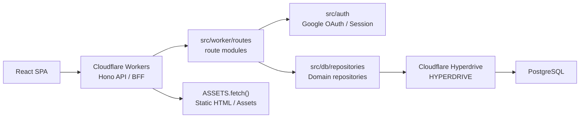

# Daily Leveling アーキテクチャ

## 概要

Daily Leveling は React SPA、Hono on Cloudflare Workers、PostgreSQL で構成する習慣トラッカー MVP です。
Worker runtime の DB 接続は `HYPERDRIVE` binding を優先し、local dev と migration では `DATABASE_URL` を使います。
ダッシュボード初期表示は `GET /dashboard/bootstrap` で today / weekly / monthly / habits / settings をまとめて返します。

## 主要な責務境界

- `src/worker/app.ts` は error handler、404、healthz、route mount だけを持つ。
- `src/worker/app.ts` は API middleware に加え、最後に静的 asset 配信を Worker 経由で委譲する。
- `src/worker/routes/*` は URL、method、request validation、response shape を扱う。
- `src/db/repositories/*` は domain ごとの SQL と mapper を扱う。
- `src/domain/*` は target day、集計、template、validation の純粋なドメインルールを扱う。
- `src/web/api.ts` は frontend からの API 呼び出しを集約する。
- `src/web/pages` は画面単位の state と orchestration を持つ。
- `src/web/components` は表示とフォーム部品を持つ。

## Dashboard Delivery

現在の frontend は複数 endpoint を並列に叩く代わりに、初期表示で `GET /dashboard/bootstrap` を使います。
これにより today / weekly / monthly / habits / settings の一貫した snapshot を 1 request で取得します。

Today view には簡易レベル情報を含めます。
- `1 completion = 10 XP`
- `100 XP` ごとに `1 level`
- レベル表示は UX フィードバック用の簡易指標で、報酬経済は持ち込みません

## DB 接続

`src/db/client.ts` は次の順序で接続文字列を解決します。

1. `env.HYPERDRIVE?.connectionString`
2. `env.DATABASE_URL`
3. どちらも無ければ `DB_MISCONFIGURED` で fail fast

`DATABASE_URL` は廃止しません。migration、local dev、Hyperdrive 作成元、緊急時の fallback として残します。
